The In-Tube Belt Clamp/Tensioner was my first 3-axis machining project, and what I used to learn the basics. As such, it's both functional and a bit of an art project.

The Clamp fits inside standard WCP [1/16-wall 2x1 punched tubing](https://wcproducts.com/collections/systems-structure/products/punched-tubing) and is intended for use with Belt-in-Tube elevators.

It consists of a Base (blue), Slider (red) and Top Plate (grey). The clamp is loosely secured in the Base by a bolt with captured spring to provide a small initial amount of clamping force that acts as a preliminary ratchet. The belt is then pulled up by hand to the desired level of tension and the Slider is locked into place with a bolt inserted through an access hole drilled in the side of the tubing. This also compresses the belt between the Base and the Slider, rigidly locking the belt to the clamp.

Once this is done, the belt can be further tensioned by about 5mm by tightening the four load bolts that transfer the belt tension loads from the Base to the Top Plate (which distributes those loads into the tubing). When fully tightened, the top of the Base will project through slots cut in the top of the tubing and the Top Plate.

15mm HTD5 Kevlar belts have a maximum working load of 225-250 lbs, after which they'll rip out of the clamp. A simulation of the design (using a belt modeled out of steel to concentrate the stresses in the clamp) indicates it has a minimum safety factor of about 5x.

Fully parametric Fusion 360 design (with manufacturing setups for the original Carvera) are [here](Files/In-tube%20Belt%20Clamp.f3z).

See also the [Speeds and Feeds](SpeedsAndFeeds.md) list; it lists the endmills used and their positions in the toolchanger.

Refer to the parameters list for more details on what you can tweak, but the most important parameters are:

* STOCK_X, STOCK_Y, and STOCK_Z - the size of your stock. You will need a chunk of 2x1 aluminum bar, cut to a length (STOCK_X) of 1.75". Measure the actual size of your stock and adjust these values.

* TOP_PLATE_THICKNESS is the measured thickness of the plate used to manufacture the Top Plate and Retainer. Anything in the range of typical gusset thickness (.9-.125") should be fine. I had some 3mm stock available, so I used that.

* BELT_OFFSET - the left/right offset needed to put the clamping surfaces so that they are exactly aligned to the belt. This will depend on your design; in the case of my YABITEME elevator [details coming soon], it's .03". If 0, this would place the center of the belt exactly between two bolt holes in the tubing.

* BELT_THICKNESS_ACTUAL - the actual measured thickness of your belt.

* BELT_COMPRESSION - the amount the belt will be squished when the locking bolt is in place. My initial ballpark amount is ~8%.

# Manufacturing

The version of the Clamp shown below does not include a small Retainer that prevents the Slider from camming when the belt is pulled through the clamp in an upwards direction; this is kept in place by a pair of 4-40 buttonheads.

The Base is machined from a 1.75" length of 2x1 Aluminum bar; the exact measured dimensions of the stock should be noted in the parameters. I found it useful to mark the origin location and order for each operation on the stock while viewing the design in the Fusion manufacturing workspace; it's too easy to make mistakes otherwise.

The first three operations machine the bolt holes in the three sides. I forgot to take a photo of the third operation.

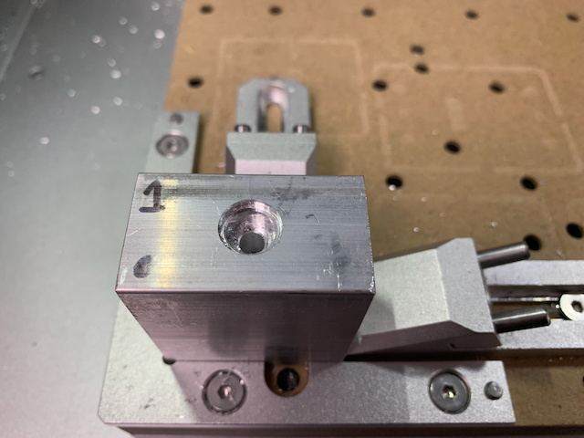
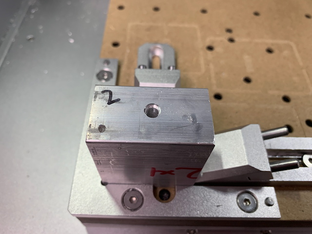

Then operations 4 and 5 machine the bottom and top respectively. The toe clamps must be installed as low as possible to avoid them getting grooved during machining (as I learned the hard way). These operations would be easier if we had a vise fixture, which is an upgrade that we intend to do, using this YouTube video as guidance: https://www.youtube.com/watch?v=jk-rzQqFdTM&t=16s

Note: the "Fine Skeleton" operations can be omitted if you don't have a 2mm endmill or don't want to spend the time to chase the last few grams of weight reduction.

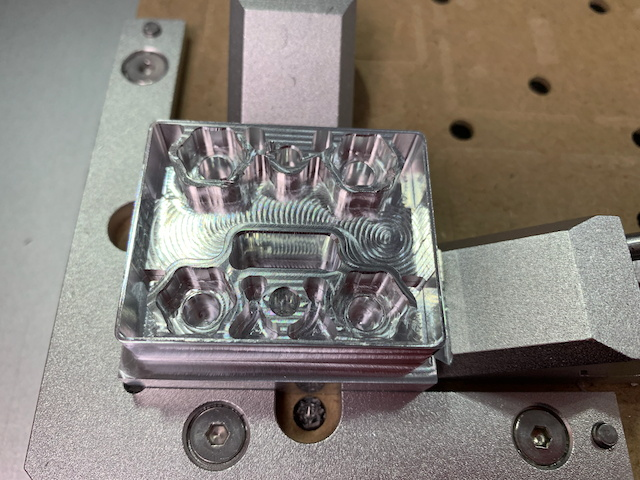
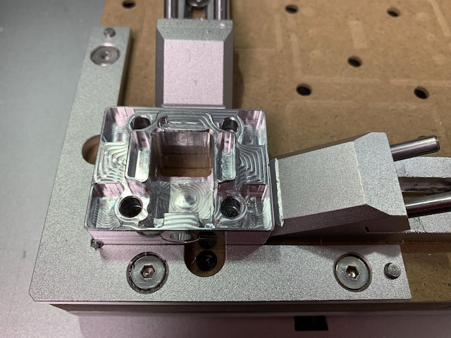

The Slider is machined in two operations from some stock that is at least 1.5" in X and Y and has been faced to 16mm in Z. The [Stock Cutter](StockCutter.md) project is handy for facing odds and ends of stock.

The first operation (again, forgot to take a photo) machines the hole and countersink used to mount the spring and retaining bolt. Then the second one completes the slider

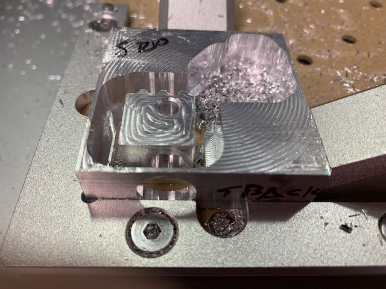

The final two operations machine the Top Plate and Retainer out of plate stock (only the former shown below)

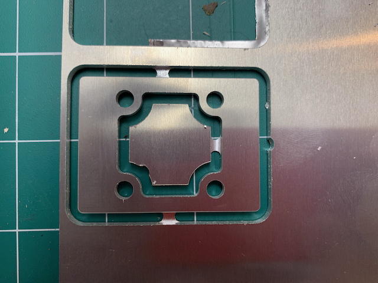

# Assembly

In addition to the machined components, you will need the following:

* 4 x 10-32 low-profile locknuts
* 4 x 10-32 x 1" socket head cap screws (buttonheads preferred)
* 1 x 10-32 x 3/4" socket head cap screw
* 1 x 10-32 x 2" socket head cap screw
* 2 x 4-40 x 1/4" or 3/8" socket head cap screw (buttonheads preferred)
* 1 small retaining spring. 4 that are just right come in the [Everbilt spring pack](https://www.homedepot.com/p/Everbilt-84-Pack-Spring-Assortment-Kit-24470/327599350) available at places like Home Depot.

The four locknuts are pressed into the base; they are an interference fit so you'll need to use a bearing press or vise to fully seat them.

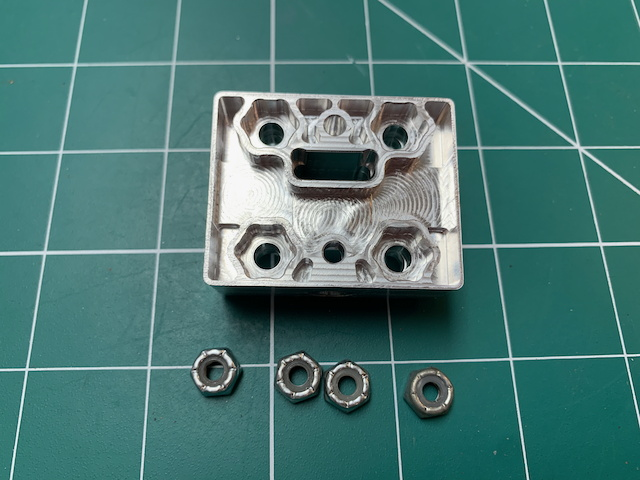
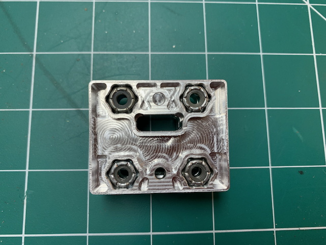

There are various holes that need to be tapped; one in the slider and five in the Base (all 10-32 except for the two small ones in the top of the base, which are 4-40). The two in the bottom of the base are utility mount holes that might come in useful at some point but are not required for normal operations. I added them on the "Better to have and not need than need and not have" principle.

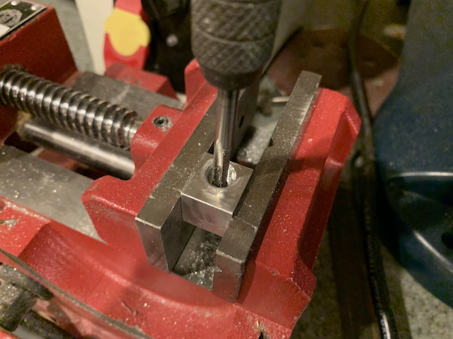
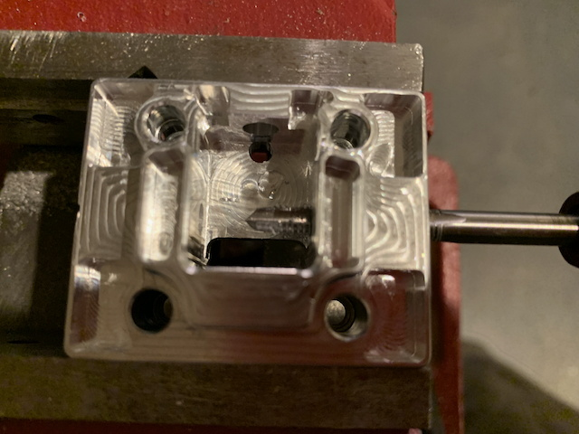

Insert the spring into the countersink in the Slider, the Slider into the Base, and secure with the 3/4" cap screw.

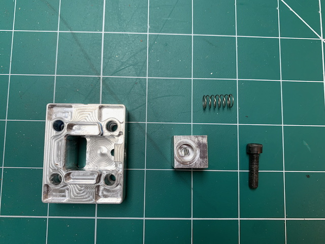
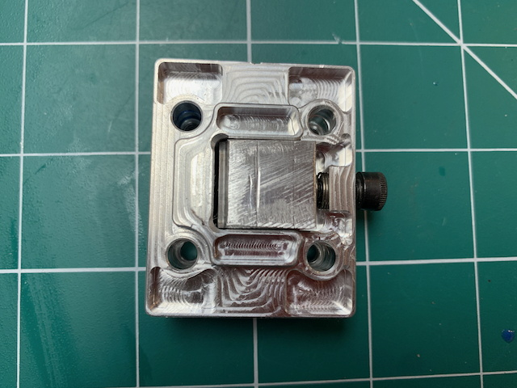

Prepare the tubing by cutting slots in the top (1x1") and bottom (1x1/2"). This can be done with a dremel, and perimeters of the slots line up with the punched holes in the tubing, as shown below:

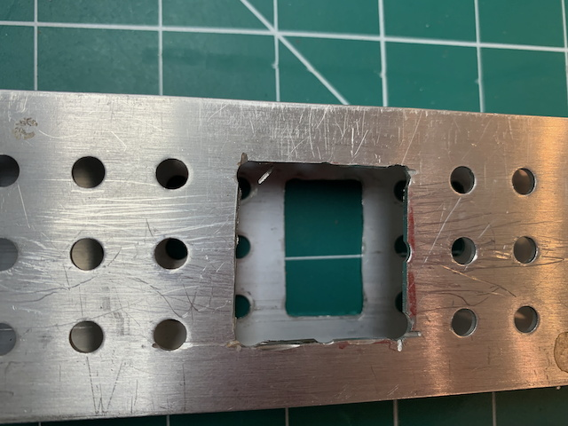

Drill a 1/2" access hole in the side of the tubing so you can later install the bolt that locks the Slider in place. It aligns with the middle of the top slot (see a later photo for a better view of this relationship). The side of the tubing that is drilled depends on the orientation of the clamp when installed.

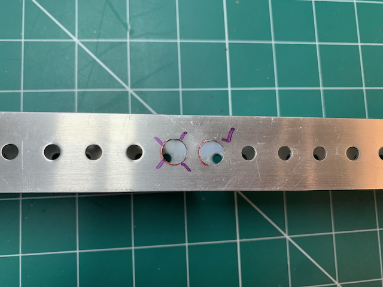

Insert the clamp into the tubing and slide it along to align with the slots in the tubing.

Place the Top Plate onto the tubing and insert the 4 1" bolts; screw them into the captured nuts in the Base, just enough to get them to catch; you want the Base to be flush with the bottom wall of the tubing at this point.

Note: I used flathead bolts here because that's all I had handy.

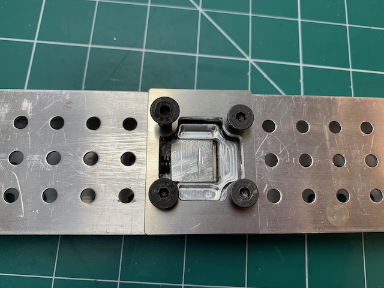

Not shown (because it was a later design revision): Attach the Retainer to the top of the base using the two 4-40 bolts, but don't tighten too much; you want the Slider to... slide!

# How to Use

Insert the belt into the bottom of the clamp and push it through. You may need to lever the slider out of the way with a small screwdriver.

Pull the belt as tight as desired. The slider should ratchet to help hold it in position, but you'll probably have to maintain tension on it during the next step (so this is a two-person job)

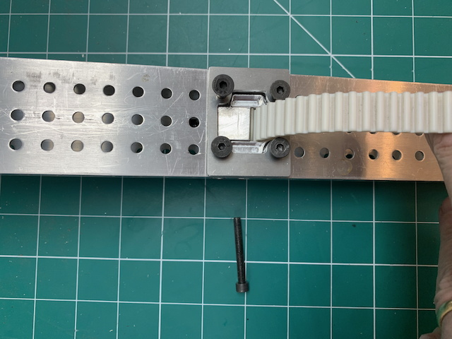

Insert the 2" bolt through the access hole and screw it into place. Since it is being pressed against the side of the hole in the slider by the belt, it'l feel like you're inserting it into a deep threaded hole. When the bolt is fully inside the tube, it'll have engaged with the threaded hole on the other side of the clamp. The Slider is now firmly locked in place, and is slightly compressing the belt.

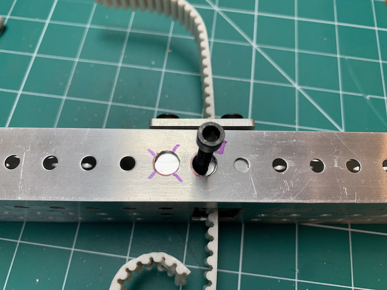
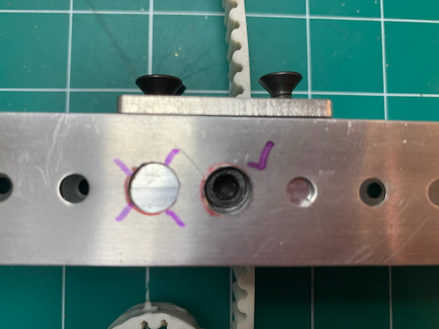

You can further increase the tension on the belt by tightening the 4 1" bolts. This will move the entire Base and Slider assembly upwards, through the slot in the tubing and the top plate. The length of travel is about 5mm, so in theory you can get any desired tension.

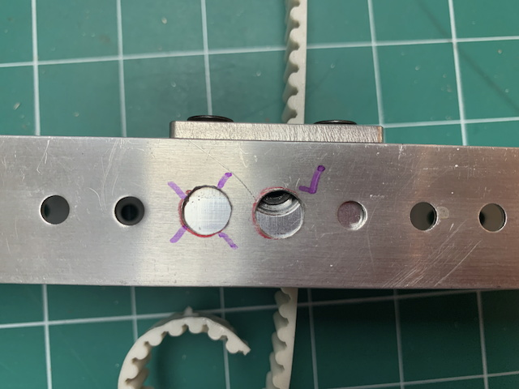
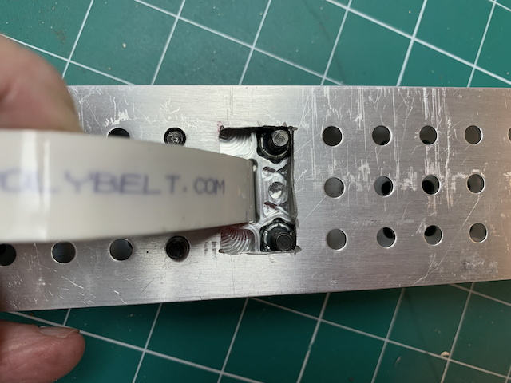

Let me know if you find this design useful!
