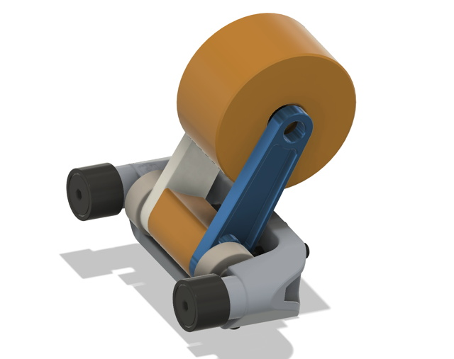

This is a very simple design that adapts the common SDS Elevator Bearing Block so that it can also be used as a mount for a constant force spring. The [Fusion Project](Files/CFS%20Bearing%20Block%20Spool.f3z) is parametric and has size values for some common constant force springs; you can also adjust the thickness of the plate being used as stock (depends on the spring size).

The orange parts (Spacer and Spool) are 3D-printed. Given the stresses are relatively low you could probably also print the arms out of a tougher plastic or machine out of something like Acetal. The Spool requires two R188 bearings and is assembled using a 1/4-20 bolt.

Note that the hole in the arm that goes onto the axle of the SDS part has a tiny lip inside it that centers the completed assembly on the axle and prevents it from rubbing on the SDS bearings. You may want to superglue the arms to the lower spacer.