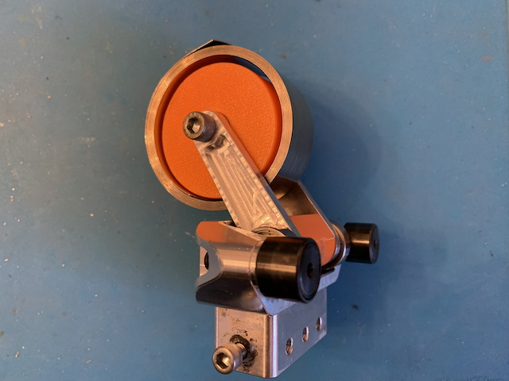
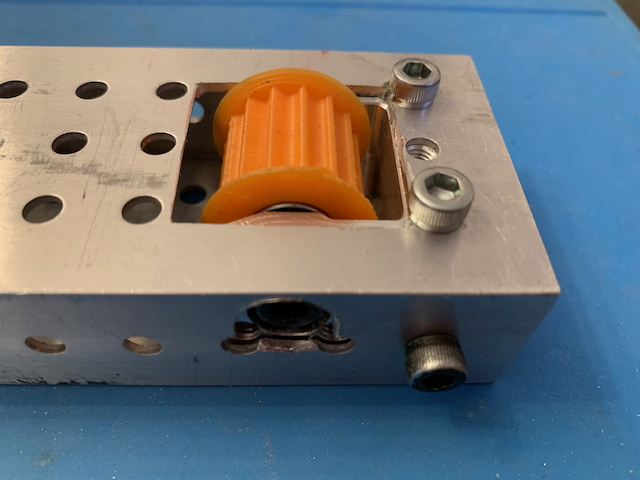
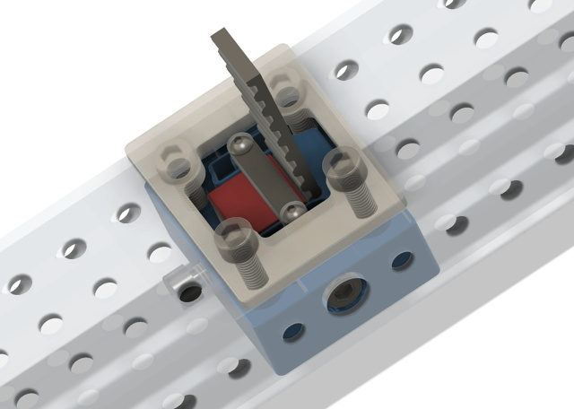

# FRC3AM - FRC stuff that can be machined on a hobby 3-Axis Milling Machine (ie: Carvera)

This repo is mostly the output of my efforts to become competent at CAM using a Carvera 3-axis Milling Machine by designing and manufacturing parts that might be useful to FRC teams.

Your comments, suggestions (both for improvements and for new parts to develop), and typo-reports are much appreciated. I can be emailed directly at trebor@madoverlord.com.

You may also find my [FRC3DP](https://github.com/RJWoodhead/FRC3DP) repo of interest, it has a lot of 3D-printable FRC designs.

# Contents

[Carvera Speeds and Feeds](SpeedsAndFeeds.md) - Concise listing of feeds and speeds for various 1/8" (3.125") Carvera endmills.

[Stock Cutter/Facer](StockCutter.md) - a Fusion 360 project that uses the Carvera to cut and face bar stock.

[SDS Bearing Block CFS Spool](CFSSpool.md) - a simple add-on for the popular SDS Elevator Bearing Block that lets it double as a mount for a constant force spring.

[SDS Idler Tube Plug](SDSIdler.md) -an iteration of the humble SDS Tube Plug that adds a mount for a belt idler, just the thing for belt-in-tube elevators.

[In-tube Belt Clamp](BeltClamp.md) - a HTD5 15mm Belt Clamp/Tensioner that fits completely inside standard WCP [1/16-wall 2x1 punched tubing](https://wcproducts.com/collections/systems-structure/products/punched-tubing) often used for constructing elevators.

# Caveat Constructor

These designs have not yet been tested in the crucible of competition. Your mileage may vary. Batteries not included. Terms and conditions may apply. Void where prohibited by law. You get what you pay for. And, of course, "some assembly required."

# License

The materials in this repository (except for those provided by outside sources) are licensed under the [Creative Commons Attribution-NonCommercial-ShareAlike 4.0 International (CC BY-NC-SA 4.0)](https://creativecommons.org/licenses/by-nc-sa/4.0/).
