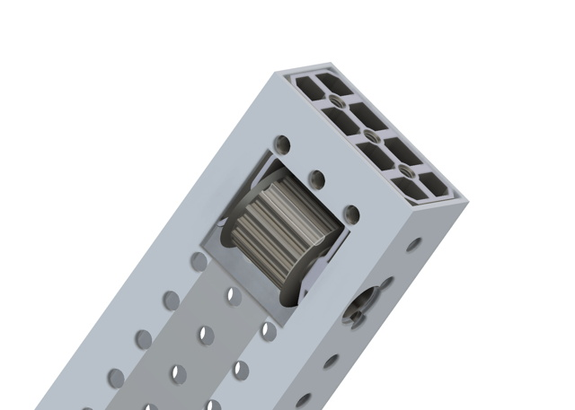

The SDS Idler Tube Plug is an extension of the SDS Tube plug that mounts a HTD5-15mm idler, for use in belt-in-tube elevator designs. The Idler spins on a 1/4-20 bolt inserted through a 1/2" hole drilled in the side of the tubing. This is a very quick 1-day design so it could definitely be cleaned up.

[Fusion Project](Files/SDS%20Idler%20Tube%20Plug.f3z)

This component is machined out of 2x1x1.75" stock, with operations on 5 sides. The stock should be measured and the STOCK_X, STOCK_Y and STOCK_Z parameters adjusted accordingly.

One of the fun things about machining is figuring out the fixturing. Since I currently don't have a vise in the CNC, the first three setups add features to the sides and top of the part but preserve the perimeters so they can be used as origin points. The last two operations create the two faces and clean up the side walls, and only the very last one needs a special origin point (see the Stock objects in the project for how this works).

I find it very useful to premark the part with the origins and sides for each operation, it's just too easy to make mistakes otherwise.

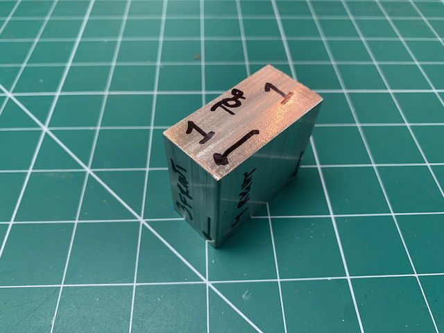
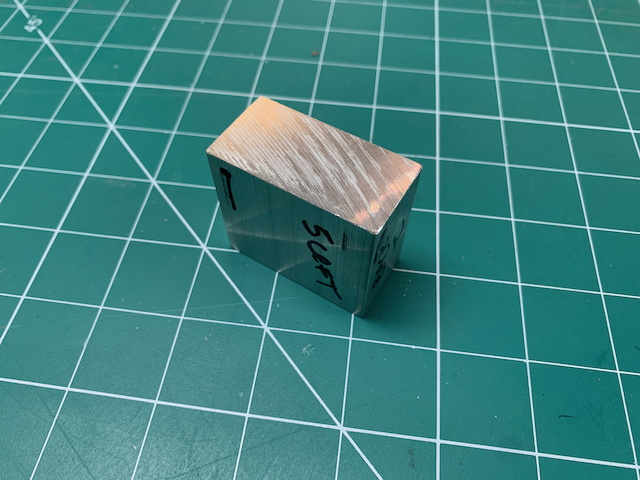

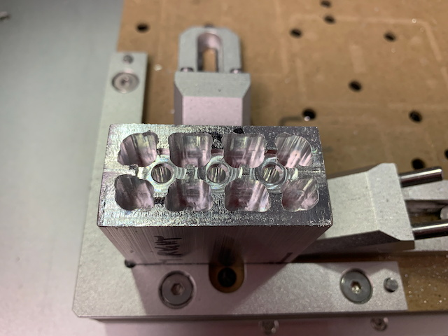
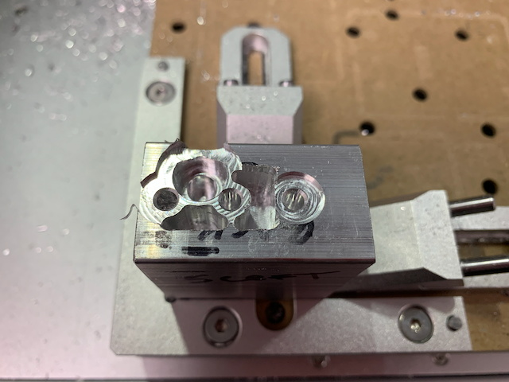
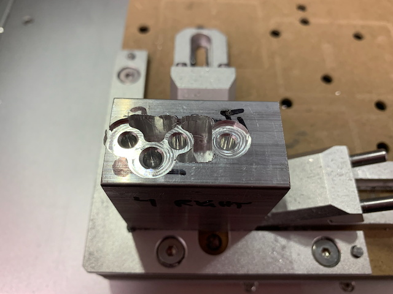
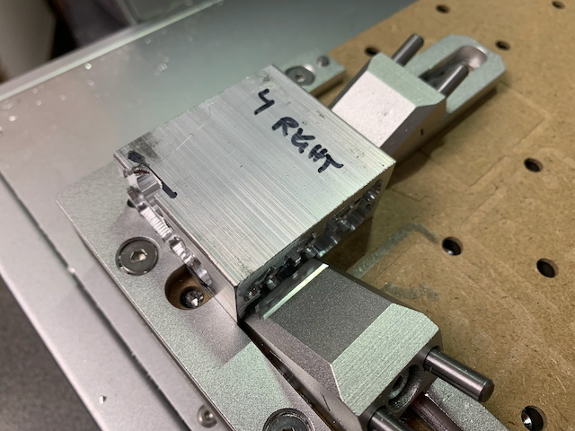
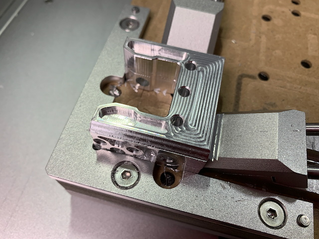
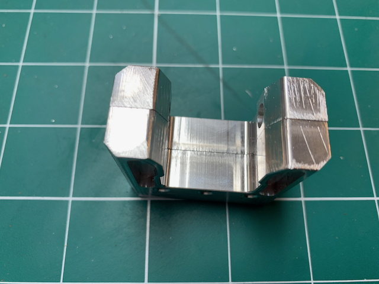

Also in the project are a couple of templates for the slot and bolt access hole. You can just screw some 10-32 bolts into them to serve as locator pins that go into the perforated tubing.

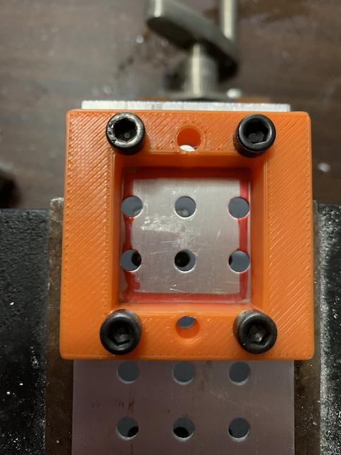
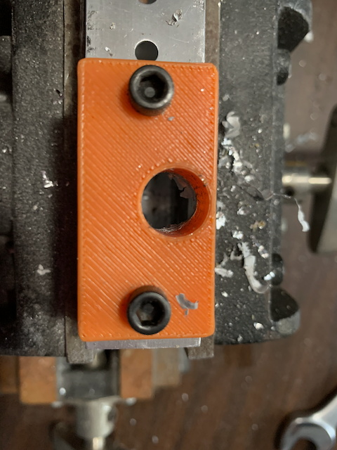

The idler in this case is a printed 15-tooth idler. I'll post a link to this soon.

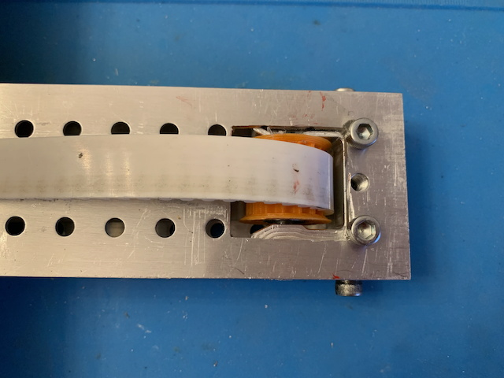
